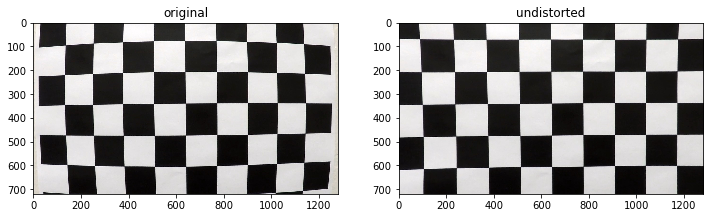

**Advanced Lane Finding Project**

The goals / steps of this project are the following:

* Compute the camera calibration matrix and distortion coefficients given a set of chessboard images.
* Apply a distortion correction to raw images.
* Use color transforms, gradients, etc., to create a thresholded binary image.
* Apply a perspective transform to rectify binary image ("birds-eye view").
* Detect lane pixels and fit to find the lane boundary.
* Determine the curvature of the lane and vehicle position with respect to center.
* Warp the detected lane boundaries back onto the original image.
* Output visual display of the lane boundaries and numerical estimation of lane curvature and vehicle position.

## [Rubric](https://review.udacity.com/#!/rubrics/571/view) Points
###Here I will consider the rubric points individually and describe how I addressed each point in my implementation.  

---
###Writeup / README

####1. Provide a Writeup / README that includes all the rubric points and how you addressed each one.  You can submit your writeup as markdown or pdf.  [Here](https://github.com/udacity/CarND-Advanced-Lane-Lines/blob/master/writeup_template.md) is a template writeup for this project you can use as a guide and a starting point.  

You're reading it!
###Camera Calibration

####1. Briefly state how you computed the camera matrix and distortion coefficients. Provide an example of a distortion corrected calibration image.

The code for this step is contained in `Camera` class in the IPython notebook located in "./advanced-lane-finding.ipynb"

I start by preparing "object points", which will be the (x, y, z) coordinates of the chessboard corners in the world. Here I am assuming the chessboard is fixed on the (x, y) plane at z=0, such that the object points are the same for each calibration image.  Thus, `objp` is just a replicated array of coordinates, and `objpoints` will be appended with a copy of it every time I successfully detect all chessboard corners in a test image.  `imgpoints` will be appended with the (x, y) pixel position of each of the corners in the image plane with each successful chessboard detection.  

I then used the output `objpoints` and `imgpoints` to compute the camera calibration and distortion coefficients using the `cv2.calibrateCamera()` function.  The result is stored with the camera class to avoid having to perform this expensive step again. I applied this distortion correction to the test image using the `cv2.undistort()` function and obtained this result: 



###Pipeline (single images)
Here I will go through the pipeline to process a single image to demonstrate the processing that's needed to detect the lane line.

This is the original image


####1. Provide an example of a distortion-corrected image.
To demonstrate this step, I call `camera.undistort()` on the test image. The result is like this.


####2. Describe how (and identify where in your code) you used color transforms, gradients or other methods to create a thresholded binary image.  Provide an example of a binary image result.
I used a combination of color and gradient thresholds to generate a binary image. The thresholding transform is contain in the `ThresholdTransformer` class. The `sobelx()` method applies x gradient threshold. The `sobely()` method applies y gradient threshold. The `magnitude()` method applies magnitude of gradient threshold. The `direction()` method applies direction of gradient threshold. The `hls_h()` method applies threshold to the H channel in HLS color image. The `hls_l()` method applies threshold to the L channel in HLS color image. The `hls_s()` method applies threhold to the S channel in HLS color image. 

Finding the right parameters for the various thresholds is a tedious trial and error process. To assist this process, I used IPython widgets and the `interact()` function which creates a set of slider widgets on the IPython notebook where I can view the result quickly after adjusting the parameters.

Once the threshold parameters are determined. The ThresholdTransformer class has a `render_preconfigured()` method that will apply the preconfigured thresholds. The result of applying the thresholds on the test image is below.


####3. Describe how (and identify where in your code) you performed a perspective transform and provide an example of a transformed image.

The code for my perspective transform is contained in the `PerspectiveTransformer`  class. It includes a `warp()` method that performs the perspective transform and a `unwarp()` method that reverses it. The perspective transform requires (`SRC`) and (`DST`) points which I have determined by trial and error and define in the PerspectiveTransformer class.

```
This following are source and destination points:

| Source        | Destination   | 
|:-------------:|:-------------:| 
| 575, 460      | 280, 0        | 
| 200, 720      | 280, 720      |
| 1130, 720     | 1000, 720     |
| 705, 460      | 1000, 0       |
```

I verified that my perspective transform was working as expected by drawing the `SRC` and `DST` points onto a test image and its warped counterpart to verify that the lines appear parallel in the warped image.


####4. Describe how (and identify where in your code) you identified lane-line pixels and fit their positions with a polynomial?

The `LaneFinder` class `mark_lane_lines()` method performs all the necessary steps to identity lane line pixels. To find the lane lines, I first undistort the image. Then I perform perspective transform to get a birds eye view. Then I apply thresholds to remove the noise. After these steps I am left with mostly lane line pixels. I then creates a histogram along all the columns in the lower half. The peaks on the left half and right half are used as the starting points. From these starting points, I use a sliding window to search upward to the top of the frame to find the lines. Finally, I fit my lane lines with a 2nd order polynomial kinda like this:


####5. Describe how (and identify where in your code) you calculated the radius of curvature of the lane and the position of the vehicle with respect to center.

The `LaneFinder` class `calc_road_info` method calculates the radius of curvature of the lane and the position of the vehicle with respect to center.

In my calculation, I use the pixels to meters conversions given in the projects.
ym_per_pix = 30/720 # meters per pixel in y dimension
xm_per_pix = 3.7/700 # meters per pixel in x dimension

To calculate the the curvatures, I rescale the x and y by the pixel to meter conversion and refit the lines. Then I used the curvature equation to calculate the left and right curvatures. The final curvatures is just an average of the left and right curvatures.

To calculate the center offset, we assume the camera is mounted at center of the car. The midpoint of the lane from the center of the image is the offset we are calculating. The center of the image in pixels is 1280 / 2 = 640.
The midpoint of the lane is given by `(((left_fit[0]*720**2+left_fit[1]*720+left_fit[2]) + (right_fit[0]*720**2+right_fit[1]*720+right_fit[2])) / 2)`. 
Once we have the offset in pixels, we can multiple by the xm_per_pix to convert it to meters. The final equation for the center offset is `((((left_fit[0]*720**2+left_fit[1]*720+left_fit[2]) + (right_fit[0]*720**2+right_fit[1]*720+right_fit[2])) / 2) - 640) * xm_per_pix`

####6. Provide an example image of your result plotted back down onto the road such that the lane area is identified clearly.

The LaneFinder class `project_lines` method implements this step. Here is an example of my result on a test image:


---

###Pipeline (video)

####1. Provide a link to your final video output.  Your pipeline should perform reasonably well on the entire project video (wobbly lines are ok but no catastrophic failures that would cause the car to drive off the road!).

Here's a [link to my video result](https://www.youtube.com/watch?v=Czk4pz23VNw)

---

###Discussion

####1. Briefly discuss any problems / issues you faced in your implementation of this project.  Where will your pipeline likely fail?  What could you do to make it more robust?

While this pipeline works reasonably well in the project videos, it still needs a lot of fine tuning to work on different road and light conditions. As an example, this pipeline fails badly on the hard chellenge vidoes when there are glare from the sun. 

